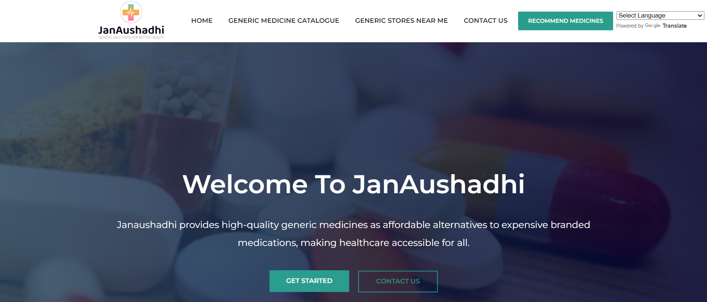
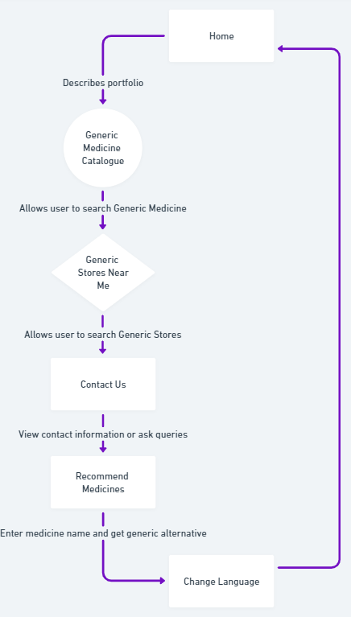

# JanAushadhi-Generic-Solutions-for-Better-Health

## Introduction
In today's healthcare landscape, the cost of prescription medications has become a significant concern for many individuals and families. Generic medicines, which are chemically equivalent to brand-name drugs but sold under different names, offer a cost-effective alternative without compromising on quality or efficacy.

### 1.1 Need for Developing a Website

The rising costs of healthcare, particularly medications, are making it increasingly difficult for many individuals to afford essential treatments. To address this issue, this platform aims to improve access to affordable medications, especially for those in underserved communities. By raising awareness of alternative medicines and their potential benefits, this website offers users more options for managing their health, ultimately leading to better health outcomes. The platform’s mission is to reduce the financial burden on individuals, helping them access needed treatments at lower costs and promoting healthier communities.

### 1.2 Problem Definition

Many individuals struggle to afford necessary medications due to escalating healthcare costs, which can result in delayed treatments and poor health outcomes. There is a need for a reliable, user-friendly platform that helps people find cheaper alternative medicines, improving access to affordable healthcare.

### 1.3 Scope of the Project

This project involves the development of a web platform that will:
1. **Recommendation System**: Allow users to enter the name of a medicine and receive a list of generic alternatives, promoting cost-effective options while ensuring efficacy.
2. **Comprehensive Database of Generic Medicines**: Create a detailed database that includes information on active ingredients, dosage, side effects, and interactions with other medications.
3. **User-Friendly Search Interface**: Implement a simple and efficient search function that enables users to find alternative medicines based on brand names, generic names, or medical conditions.
4. **Database Updates**: Continuously update the database with new information on generic medicines and their pricing.

### 1.4 Features of the Project

- **Generic Medicine Recommender**: Users receive recommendations for generic alternatives based on the specific medicines they provide.
- **Comprehensive Database**: A vast collection of information on alternative medicines, including active ingredients, side effects, and more.
- **Language Translation**: A translation API (like Google Translate) to dynamically translate website content based on the user’s selected language.
- **Location-Based Search**: Allow users to search for medicines and nearby stores based on their current location.
- **User-Friendly Search**: An intuitive search function that helps users find alternatives easily.

### 1.5 GUI of Web Pages

1. **Home Page**: The landing page that introduces users to the platform and its purpose.
2. **Medicine Catalogue Page**: A page where users can search for generic medicines.
3. **JanAushadhi Stores Page**: A page that lists JanAushadhi stores based on the user’s state and district.
4. **Contact Us Page**: A page for users to contact the IT staff for queries or suggestions.
5. **Recommendation Page**: A page where users receive generic alternatives based on a provided medicine name.
6. **Language Translation**: A page that allows users to translate the website into their preferred language.

## Implementation Methodology

### 2.1 Design

#### 2.1.1 Block Diagram / Flowchart of Proposed System

The flowchart illustrates how the proposed system works, from input (medicine name) to output (generic alternatives and other related information).

### 2.2 Hardware and Software Requirements

#### 2.2.1 Hardware Requirements:
- **Processor**: Intel Core i3 or i5
- **RAM**: 4 GB or more
- **Disk Space**: 2 GB

#### 2.2.2 Software Requirements:
- **Operating System**: Ubuntu, Linux, Raspbian OS
- **Technologies**: HTML, CSS3, JavaScript, Python, Django, Streamlit
- **Browsers**: Mozilla Firefox, Google Chrome
- **Disk Space**: 2 GB

## Implementation

### 3.1 Data Preprocessing

1. **Data Collection**: Collect information about generic medicines and their alternatives.
2. **Data Cleaning**: Clean and preprocess the collected data to ensure accuracy and consistency.
3. **Data Transformation**: Transform the data into a structured format for easy access and analysis.

### 3.2 Recommendation System

1. **Medicine Search**: Develop a recommendation algorithm that identifies and suggests generic alternatives based on the user’s input (medicine name).
2. **Similarity Matching**: Implement algorithms to calculate the similarity between medicines based on their active ingredients, dosage, and efficacy.

### 3.3 Frontend Development

1. **User Interface Design**: Create a responsive, user-friendly design using HTML, CSS, and JavaScript.
2. **Interactive Features**: Develop interactive components such as search boxes, location-based search, and language translation.

### 3.4 Backend Development

1. **Database Integration**: Set up a robust database to store medicine information, user queries, and recommendations.
2. **API Integration**: Implement an API for location-based search and language translation.

### 3.5 Deployment

1. **Web Application Hosting**: Deploy the website using a reliable cloud hosting platform.
2. **User Access**: Make the platform publicly accessible and easy to navigate.

## Future Enhancements

- **Collaborative Filtering**: Incorporate collaborative filtering techniques to suggest alternatives based on user behavior and preferences.
- **User Feedback**: Implement feedback mechanisms where users can rate the suggestions, improving the system’s recommendations over time.
- **Mobile App**: Extend the platform to mobile devices to increase accessibility and user engagement.

## Contributors

This project is the result of collaborative efforts from the following team members:

1. [Mangesh Pangam](https://github.com/Mangesh2704)

2. [Rakshita Sarap](https://github.com/RakshitaSarap)

3. [Saish Rane](https://github.com/saishrane-11)

## Acknowledgments

- Special thanks to [JanAushadhi Portal](https://janaushadhi.gov.in/) for providing the information of JanAushadhi Kendras and Generic Medicines.
- We would like to acknowledge the inspiration and guidance from various online resources and tutorials.

#### Live Demo: https://janaushadhi-generic-solutions-for-better.onrender.com

